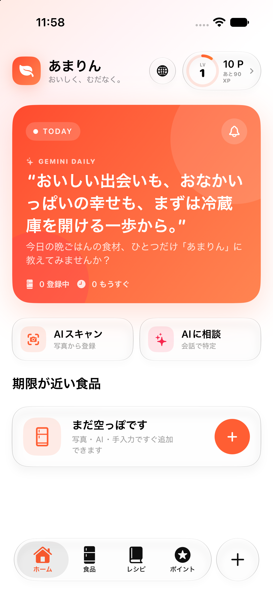
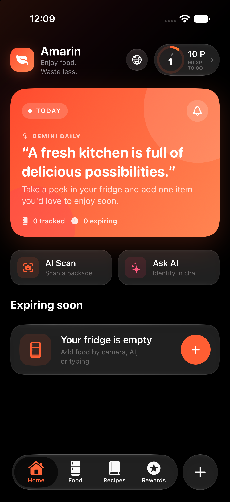
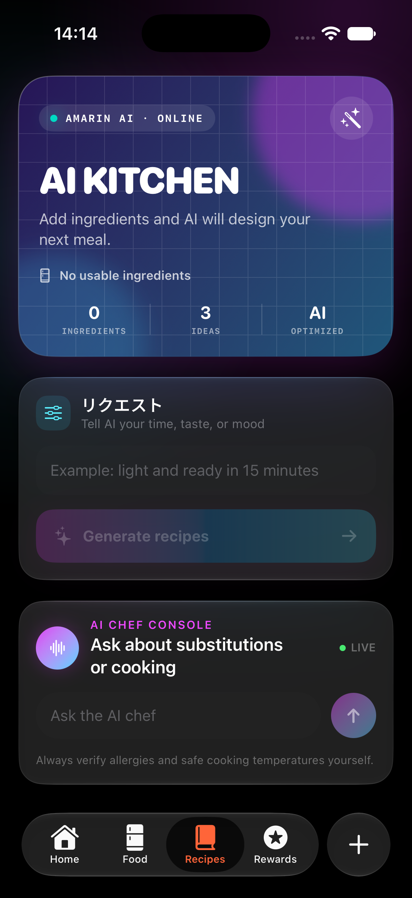
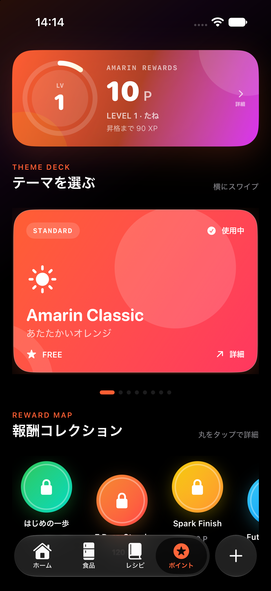

# Amarin

**A native iOS food-expiry companion powered by Gemini AI.**

Amarin helps people use food before it expires, discover recipes from ingredients they already own, and turn lower food waste into a rewarding daily habit. The primary iOS experience is built with SwiftUI and adopts Apple's Liquid Glass design language on supported systems.

<p align="center">
  
  
</p>

### AI Kitchen and rewards

<p align="center">
  
  
</p>

The AI Kitchen turns the current fridge inventory into practical meal ideas instead of generic recipe search results. It prioritizes food approaching its expiry date, distinguishes ingredients already available from items that may need to be purchased, and keeps a conversational chef available for substitutions and follow-up questions.

The reward system separates spendable points from lifetime XP. Points can unlock visual themes and collectible rewards, while lifetime XP preserves long-term progress even after an exchange. Recording food waste applies a clear penalty, creating meaningful feedback without erasing the player's level history.

## Product highlights

- **Expiry dashboard** — see urgent items first, understand remaining days at a glance, and record whether food was finished or wasted.
- **Gemini Daily** — an original daily food-saving quote and practical action generated by Gemini, cached per language for the day.
- **AI package scanning** — use the camera or Photo Library to identify a product, category, and printed expiry date.
- **Modern AI registration chat** — describe a package naturally; the Gemini agent asks one focused question at a time and presents a structured item card when ready.
- **AI Kitchen** — generate three practical recipes that prioritize registered ingredients nearing expiry, then continue the conversation with an AI chef.
- **Points and levels** — earn 10–20 points for finishing food before expiry. Waste deducts points while lifetime XP remains intact.
- **Reward collection** — unlock themes, badges, effects, and preview rewards through a swipeable, game-inspired reward map.
- **Smart reminders** — schedule local notifications three days before expiry and again on the expiry date.
- **Japanese and English** — follow the iPhone language automatically or choose a language inside the app.
- **Automatic appearance** — follows system Light or Dark Mode with adaptive SwiftUI colors, materials, and Liquid Glass surfaces.

## Native iOS app

Open `Amarin/Amarin.xcodeproj` in Xcode, select the **Amarin** scheme and an iPhone simulator, then run the project.

Requirements:

- macOS with Xcode
- iOS 17 or later
- iOS 26 or later for the newest Liquid Glass presentation

The native target has no Flutter or CocoaPods dependency. Food records, reward progress, selected theme, language, and notification preferences are stored locally with `UserDefaults`.

## AI architecture

The app never embeds a Gemini API key. All AI requests go through the Cloudflare Worker in [`backend/gemini-worker.js`](backend/gemini-worker.js).

| Endpoint | Purpose |
| --- | --- |
| `POST /analyze-expiry` | Extract product name, category, and date from a package photo |
| `POST /identify-product` | Run the conversational product-registration agent |
| `POST /suggest-recipes` | Generate recipes from valid registered ingredients |
| `POST /recipe-chat` | Answer follow-up cooking and substitution questions |
| `POST /daily-quote` | Generate the localized Gemini Daily message |

The Worker validates input, requests structured JSON, excludes expired ingredients from recipe generation, and automatically falls back to another Gemini model during temporary capacity errors.

### Deploy the Worker

```bash
cd backend
npx wrangler secret put GEMINI_API_KEY
npx wrangler deploy
```

Keep the API key in a Cloudflare secret. Do not add it to the app, repository, or `wrangler.toml`.

## Flutter companion

The repository also includes the original cross-platform Flutter implementation for Android, iOS, web, Windows, macOS, and Linux.

```bash
flutter pub get
flutter run
```

## Verification

```bash
cd backend && npm test
flutter analyze
flutter test
```

## Privacy and safety

- Food and reward data stays on the device.
- Images are sent to the configured AI Worker only when the user requests analysis.
- AI recipes avoid expired registered items, but users must verify allergies, food condition, and safe cooking temperatures themselves.

## Project status

Amarin is an actively developed demo and product prototype. Reward coupons and partner-store benefits are previews and are not redeemable for real-world value.
