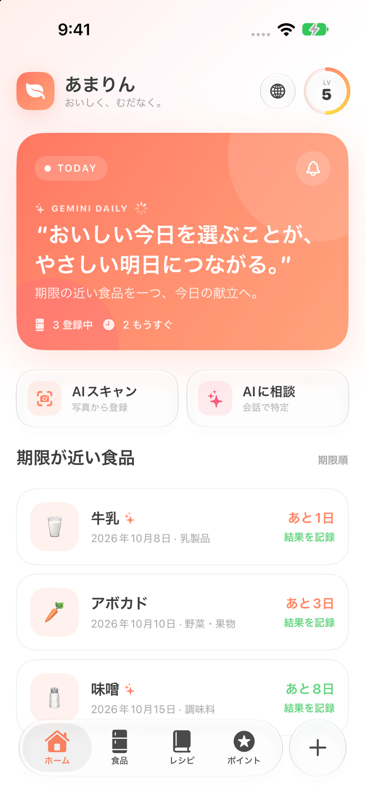
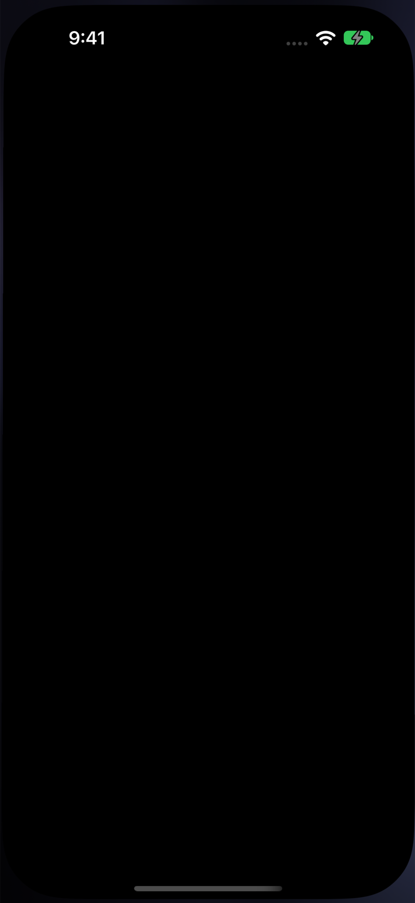
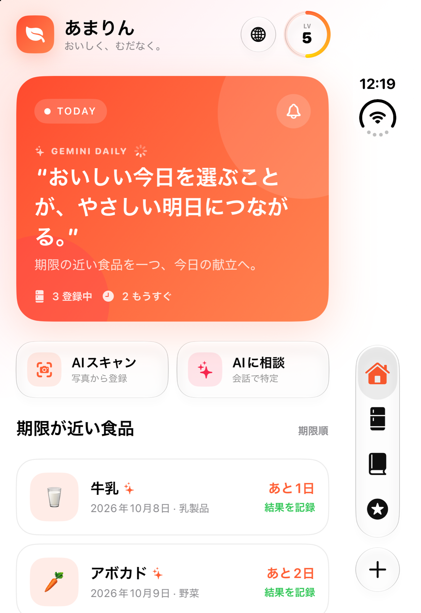
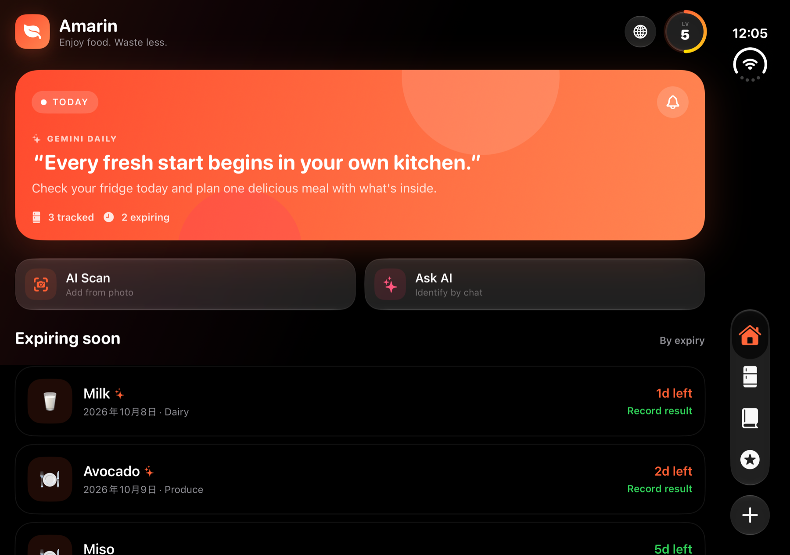

# Amarin Screenshot Gallery

Captured with Xcode on October 7, 2026. The gallery covers all 11 primary product surfaces: Home, Food List, AI Kitchen, Rewards, Add Methods, AI Product Chat, Manual Add, Language Settings, Expiry Alerts, Level Details, and Reward Details.

| Device | State | Language / appearance | Screens |
|---|---|---:|---:|
| iPhone 18 Pro | Standard | English / Dark | 11 |
| iPhone 18 Pro | Standard | Japanese / Light | 11 |
| iPhone Duo | Closed outer display | English / Dark | 11 |
| iPhone Duo | Closed outer display | Japanese / Light | 11 |
| iPhone Duo | Open inner display | English / Dark | 11 |
| iPhone Duo | Open inner display | English / Light | 11 |

## Highlights

| iPhone 18 Pro — Japanese | iPhone 18 Pro — English |
|---|---|
|  |  |

| iPhone Duo — Closed | iPhone Duo — Open |
|---|---|
|  |  |

## Files

- [`iphone-18-pro`](screenshots/gallery-2026/iphone-18-pro/) — Japanese and English captures.
- [`iphone-duo/closed`](screenshots/gallery-2026/iphone-duo/closed/) — Closed outer-display captures in Japanese and English.
- [`iphone-duo/open`](screenshots/gallery-2026/iphone-duo/open/) — Open inner-display captures in English, dark and light appearances.

All images are simulator-only demo data; no personal device content is included.
