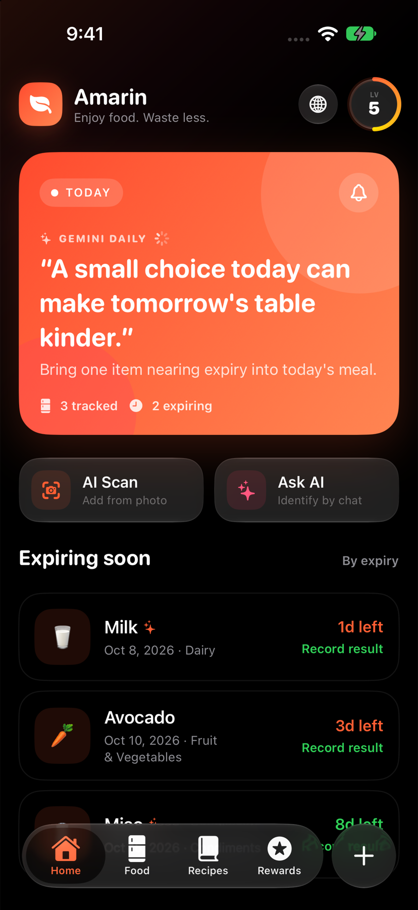
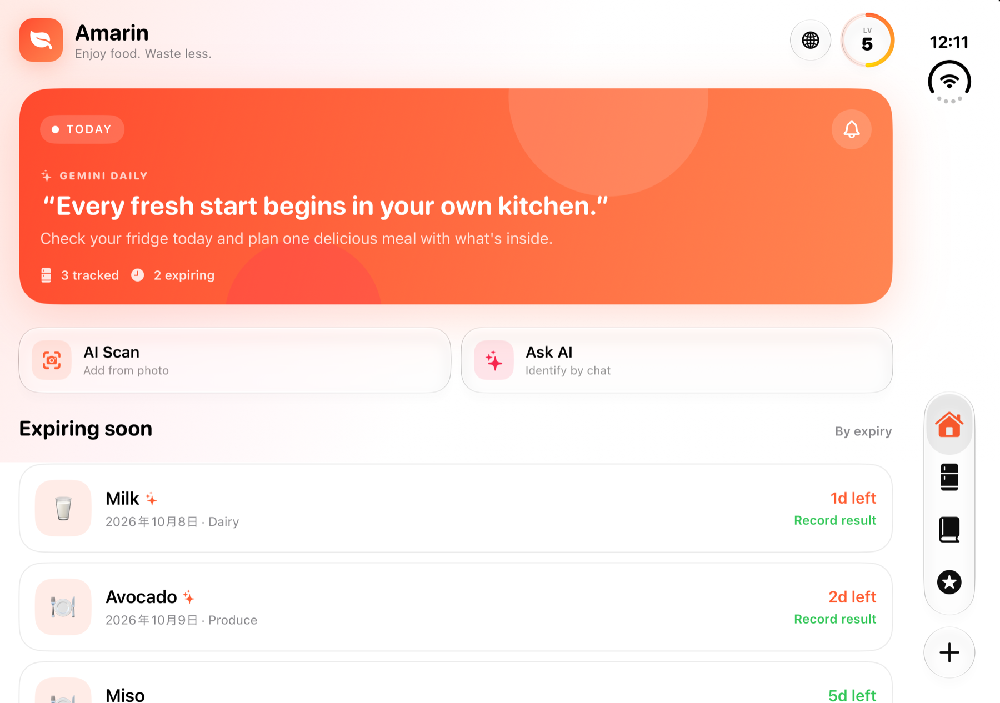

# Amarin Screenshot Gallery

Captured with Xcode on October 7, 2026. Every set covers the same 11 product surfaces: Home, Food List, AI Kitchen, Rewards, Add Methods, AI Product Chat, Manual Add, Language Settings, Expiry Alerts, Level Details, and Reward Details.

## Device coverage

| Device | Configuration | Language / appearance | Screens |
| --- | --- | --- | ---: |
| iPhone 18 Pro | Standard | English / Dark | 11 |
| iPhone 18 Pro | Standard | Japanese / Light | 11 |
| iPhone Duo | Closed outer display | English / Dark | 11 |
| iPhone Duo | Closed outer display | Japanese / Light | 11 |
| iPhone Duo | Open inner display | English / Dark | 11 |
| iPhone Duo | Open inner display | English / Light | 11 |

## iPhone 18 Pro

  
  &nbsp;&nbsp;
  

Japanese · Light &nbsp;&nbsp;&nbsp;&nbsp; English · Dark

## iPhone Duo

The adaptive SwiftUI layout supports both the compact outer display and the expanded inner display. The image widths below are balanced to keep the two different aspect ratios visually aligned.

  
  &nbsp;&nbsp;
  

Closed outer display &nbsp;&nbsp;&nbsp;&nbsp; Open inner display

### Open-display appearances

  
  

Light Mode &nbsp;&nbsp;&nbsp;&nbsp; Dark Mode

## Complete functional capture sets

| Capture set | Contents |
| --- | --- |
| [iPhone 18 Pro — Japanese](screenshots/gallery-2026/iphone-18-pro/ja/) | 11 screens · Light Mode |
| [iPhone 18 Pro — English](screenshots/gallery-2026/iphone-18-pro/en/) | 11 screens · Dark Mode |
| [iPhone Duo closed — Japanese](screenshots/gallery-2026/iphone-duo/closed/ja/) | 11 screens · Outer display · Light Mode |
| [iPhone Duo closed — English](screenshots/gallery-2026/iphone-duo/closed/en/) | 11 screens · Outer display · Dark Mode |
| [iPhone Duo open — English Light](screenshots/gallery-2026/iphone-duo/open/en-light/) | 11 screens · Inner display · Light Mode |
| [iPhone Duo open — English Dark](screenshots/gallery-2026/iphone-duo/open/en/) | 11 screens · Inner display · Dark Mode |

All screenshots contain simulator-only demo data. No personal device content is included.
